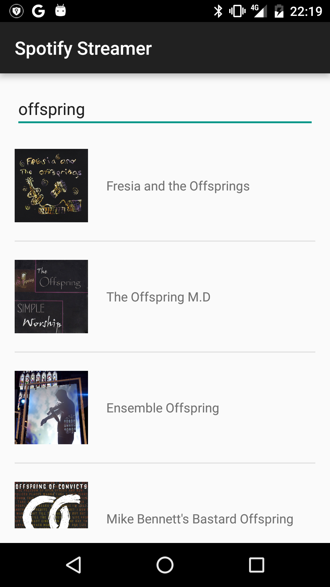
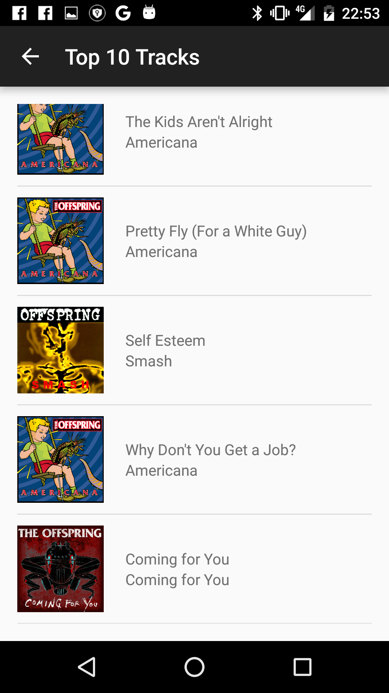
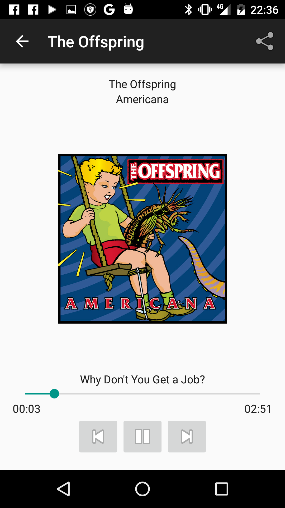

# spotify-streamer
By: Olivier Leplus as part of the Udacity Android Nanodegree

A music streaming application to replicate one of the most popular app experiences in the world. This app allows you to search for an artist on Spotify API, and lets you play a sample of the artist's top tracks. 

The app implements services, broadcast receivers, notifications, media player controls, fragments, and more.
It has a tablet and phone views.
It also implements notification controls

### Phone Screenshots
 |  | 
------------ | ------------- | -------------

